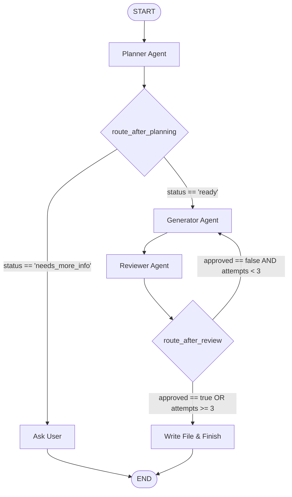

# LangChain Math Puzzle Agent

> The repository now also contains the first PhysicsForge web vertical slice:
> a FastAPI/PostgreSQL backend and a trusted React/SVG projectile renderer. The
> existing CLI remains available while the structured GameSpec workflow is
> migrated incrementally.

## Web application quick start

Requirements: Python 3.11+, Node.js, npm, and Docker.

To run PostgreSQL, the API, and the frontend together with Docker:

```bash
cp .env.example .env # optional; add OPENAI_API_KEY for model-backed generation
docker compose up --build
```

Open `http://localhost:5173`. The API is also available directly at
`http://localhost:8000`; database migrations run automatically at startup.

To stop the stack, press Ctrl-C and run `docker compose down`. Add `-v` only
when you also want to delete the PostgreSQL data volume.

For local development without containerizing the API and frontend:

```bash
cp .env.example .env
docker compose up -d postgres
python3.11 -m pip install -e '.[dev]'
alembic upgrade head
physicsforge-api
```

In a second terminal:

```bash
cd frontend
npm install
npm run dev
```

Open `http://localhost:5173`. Vite proxies `/api` to FastAPI on port 8000.
The current vertical slice loads the solver-verified demo contract from
`GET /api/v1/games/demo` and falls back to the same bundled fixture when the
API is unavailable.

Verification:

```bash
python3.11 -m pytest
cd frontend
npm run typecheck
npm test
npm run build
npm run test:visual # first install Chromium: npx playwright install chromium
```

CI runs migrations and Python tests against PostgreSQL, checks and builds React,
runs deterministic desktop/mobile browser tests, and builds both production
images. See [`docs/DEPLOYMENT.md`](docs/DEPLOYMENT.md) for release guidance.

The complete migration roadmap is in
[`docs/IMPLEMENTATION_PLAN.md`](docs/IMPLEMENTATION_PLAN.md).

The legacy CLI's screenshot reviewer is optional in the web runtime. Install
it with `python3.11 -m pip install -e '.[legacy-visual-review]'` and then run
`playwright install chromium` when using the original HTML workflow.

This is a production-style, multi-turn LangGraph application for generating a single interactive p5.js math-puzzle page from a chat.

The user chats with a single agent interface. Internally, the agent orchestrates a multi-agent LangGraph workflow featuring a Planner, Generator, and Reviewer loop.



### Flow Architecture & Core Nodes

1. **Planner Node (`planner`)**:
   - Acts as the initial coordinator. Inspects conversation history and determines if there are enough details to define the math puzzle.
   - Outputs a structured `PlannerDecision` containing:
     - `status`: Either `"needs_more_info"` or `"ready"`.
     - `next_question`: Clarification prompt for the user.
     - `puzzle_spec`: A validated `PuzzleSpec` defining the math properties, physics criteria, hint/solution text, and animation steps.
2. **Ask User Node (`ask_user`)**:
   - Presents the planner's clarification question to the user and pauses execution, waiting for the user's reply.
3. **Generator Node (`generator`)**:
   - Triggered once the planner's status is `"ready"`.
   - Synthesizes a standalone, interactive HTML/JS/CSS page using `p5.js` for canvas rendering.
   - If returning from a review cycle, receives the previous code draft and the reviewer's feedback to make target fixes.
4. **Reviewer Node (`reviewer`)**:
   - Inspects the generated HTML code against the `PuzzleSpec` and design rules.
   - Outputs a structured `ReviewerDecision` containing:
     - `approved`: Boolean flag.
     - `feedback`: Detailed issues found (e.g. animation logic errors, contrast violations, missing elements).
5. **Write File & Finish Node (`write_file_and_finish`)**:
   - Performed upon approval or after a fallback limit of `3` attempts to prevent infinite loops.
   - Saves the verified HTML code directly to `generated/math_puzzle.html` and provides the file link to the user.

Conversation state is persisted in `puzzle_agent.sqlite` using LangGraph's SQLite checkpointer. Re-running the CLI continues the same conversation when `PUZZLE_THREAD_ID` has the same value.

## Setup

```bash
cd "/Users/yaswanthpotti/Documents/Personal Work/langchain-math-puzzle-agent"
cp .env.example .env
# Edit .env and add OPENAI_API_KEY
uv sync
uv run python -m math_puzzle_agent.cli
```

Use a different conversation by setting `PUZZLE_THREAD_ID` in `.env`. The generated one-file page is saved to `generated/math_puzzle.html`; open it in a browser to play the puzzle.

## Example chat

```text
You: Make a puzzle about a boy throwing a ball through a hoop.
Agent: How far away and how high is the hoop?

You: It is 8 metres away and 3 metres high. Use a launch speed of 12 m/s.
Agent: Your interactive puzzle is ready: .../generated/math_puzzle.html
```

## Test without an API key

```bash
uv run pytest
```

`OPENAI_MODEL` is configurable in `.env`; select a model available to your OpenAI account.
